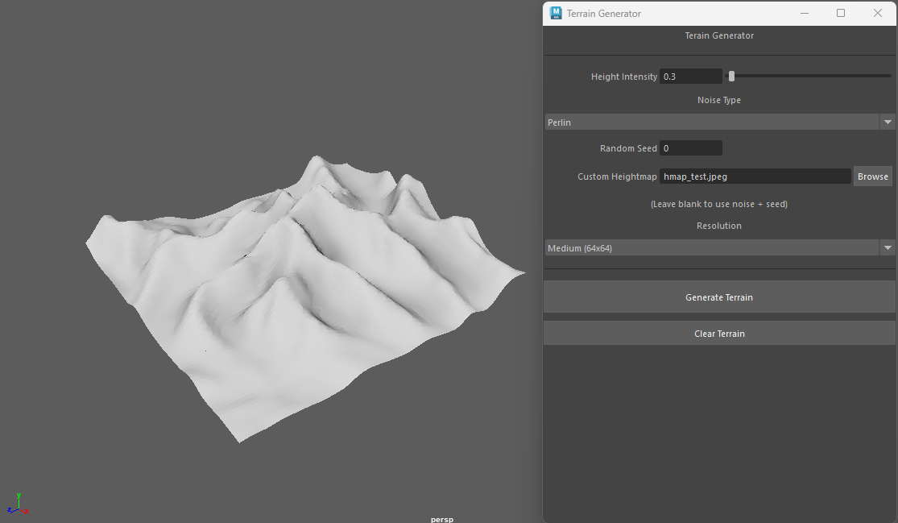
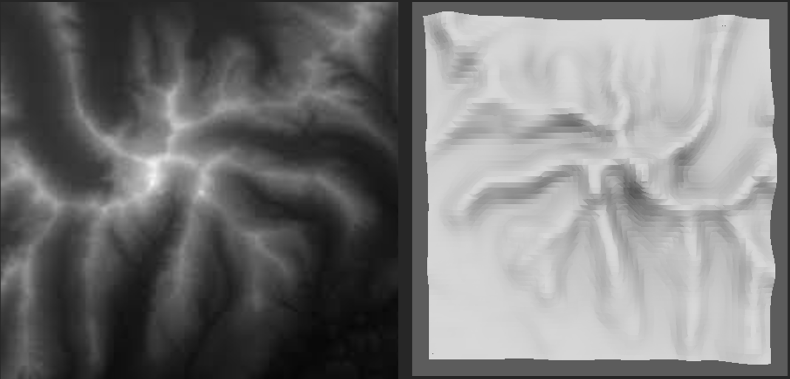
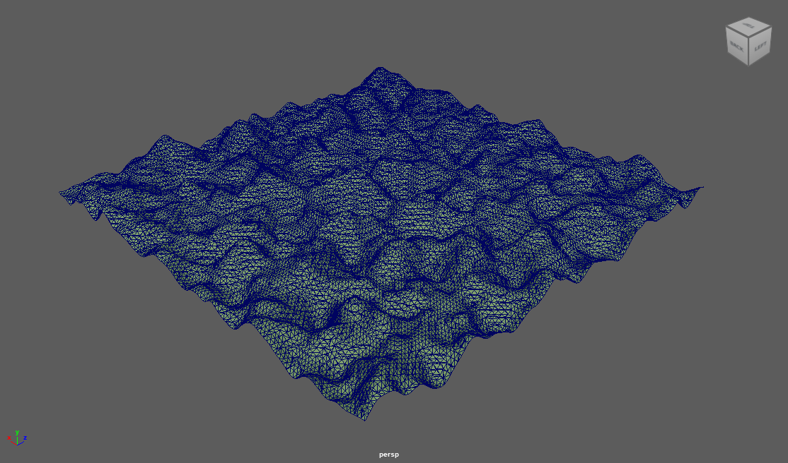
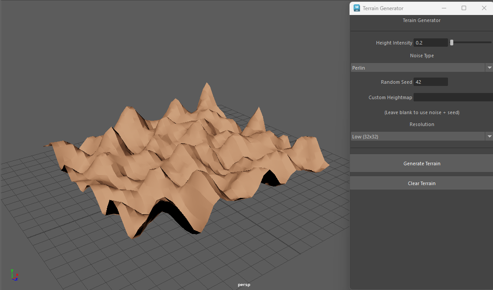
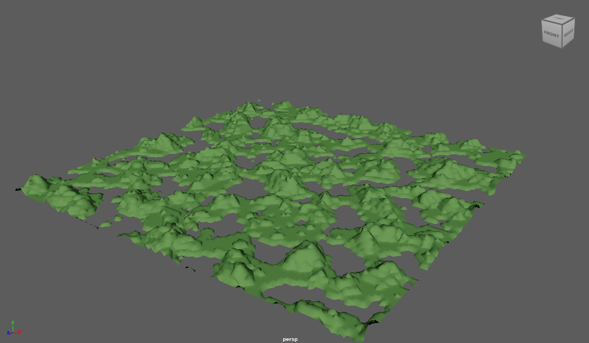

# terran-generator-maya-tool
A custom maya tool developed using Python and the Open Maya 2.0 API. Uses the marching cubes algorithm to generate a mesh from either noise or texture input

# Dependencies
Before running the tool, make sure to install the following Python libraries:
```
pip install Pillow noise scipy
```
# Set up in Maya
1. Clone this repository.
2. Place the Python files and dependency folders inside the scripts folder in your Maya project.
3. In Maya, either create a custom shelf button for the tool or open 'main.py' in the script editor and run it to open the tool GUI. 

# Example Images
#### Texture input example

#### Texture and Result comparison (inverted)

***
#### Random Seed Examples

***

***

